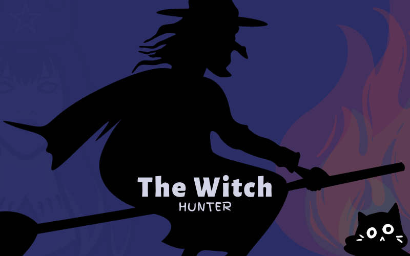

# Witch Hunt

*Spetial thanks to the **[ARVRlab](https://arvr-lab.com)** for the Meta Quest2 as a test device, available for the duration of competition.*

*The graphics are created by **Éva Erdősi***

> **In this game you play as a witch hunter trying to catch witches.**

## Witch Hunter Characters

- [Matthew Hopkins](MatthewHopkins.js)
- [Jacob Sprenger](JacobSprenger.js)
- [Charles Borromeo](CharlesBorromeo.js)
- [Samuel Parris](SamuelParris.js)
- [Heinrich Kramer](HeinrichKramer.js)

Each character has a set of stats that are used to determine their abilities and skills. These stats are:
- Witchsense: Determines the character's ability to sense witches.
- Health: Determines the character's health, maximum health is 13, minimum is 1. If the character's health is reduced to 0, the character dies.
- Stamina: Determines the character's stamina, maximum stamina is 100, minimum is 1. If the character's stamina is reduced to 0, the character dies.
- Strength: Determines the character's strength, maximum strength is 100, minimum is 1.
- Torture: Determines the character's ability to torture witches. The higher the torture, the more effective the character is at torturing witches.
- Intelligence: Determines the character's intelligence. The intelligence of the character is used to determine the character's ability to understand and analyze situations. More intelligence can give more ideas and thoughts about how to deal with a situations.
- Wisdom: Determines the character's wisdom. More wisdom can give more ideas and thoughts about how to deal, and can open more options to solve problems.
- Charisma: Determines the character's charisma. More charisma can make the character more persuasive and more likely to get what they want.
- Luck: Determines the character's luck. More luck can make the character more likely to succeed in difficult situations.
- Magic Resistance: Determines the character's ability to resist magic. Sometimes the witches what you are pursing are using magic to resist the witch hunters.

These characters are used in the game. They are all related to the witch hunts in history, The main story of each character is based on real historical events. To get more info about the characters, you can check the links below:
- [Witch hunters](https://en.wikipedia.org/wiki/Category:Witch_hunters)
- [Matthew Hopkins](https://en.wikipedia.org/wiki/Matthew_Hopkins)
  - [THE WITCHFINDERS GENERAL: WHO WERE THE CONTEMPORARIES OF MATTHEW HOPKINS?](https://earlofmanchesters.co.uk/the-witchfinders-general-who-were-the-contemporaries-of-matthew-hopkins/#:~:text=With%20Hallowe%27en%20bearing%20down,was%20by%20no%20means%20alone.)
- [Jacob Sprenger](https://en.wikipedia.org/wiki/Jacob_Sprenger)
  - [The Malleus Maleficarum](https://en.wikipedia.org/wiki/Malleus_Maleficarum)
- [Charles Borromeo](https://en.wikipedia.org/wiki/Charles_Borromeo)
  - [The Counter-Reformation](https://en.wikipedia.org/wiki/Counter-Reformation)
- [Samuel Parris](https://en.wikipedia.org/wiki/Samuel_Parris)
  - [The Salem Witch Trials](https://en.wikipedia.org/wiki/Salem_witch_trials)
- [Heinrich Kramer](https://en.wikipedia.org/wiki/Heinrich_Kramer)
  - [The Malleus Maleficarum](https://en.wikipedia.org/wiki/Malleus_Maleficarum)

## Witches

> These are the witches that are available in the game. The withces should be hunted by the witch hunter. But each of them has a special ability that can be used to their advantage, also, they have a health bar, and when they are defeated, they will be added to the list of defeated witches. The defeated witches can be used to create a potion that can be used to heal the witch hunter. The witches can hurt the witch hunter, and the witch hunter can also use torture to get the testimony from the witches.

The list of available witches:
- [Agnes Waterhouse](AgnesWaterhouse.js)
- [Catherine Peyretone](CatherinePeyretone.js)
- [Elisabeth Plainacher](ElisabethPlainacher.js)
- [Guirand de Lay](GuiranddeLay.js)
- [Gyde Spandemager](GydeSpandemager.js)
- [Johannes Junius](JohannesJunius.js)
- [Lady Glamis](LadyGlamis.js)
- [Lasses Birgitta](LassesBirgitta.js)
- [Marigje Arriens](MarigjeArriens.js)
- [Michee Chauderon](MicheeChauderon.js)
- [Petronillade Midia](PetronilladeMidia.js)
- [Polissena of SanMacario](PolissenaofSanMacario.js)
- [Ursula Kemp](UrsulaKemp.js)

> The witches are based on real historical figures, but the special abilities are made up. The health, attack, stamina, strength, torture, intelligence, wisdom, charisma, luck and magic resistance are all based on the original witches, but the values are fictional.

To get more information about the witches, you can check the links below:
- [List of real historical people executed for witchcraft](https://en.wikipedia.org/wiki/List_of_people_executed_for_witchcraft)
- [Notable women executed in the Salem witch trials](https://www.history.com/news/notable-women-executed-salem-witch-trials)
- [Witchipedia: Ireland's most famous witches](https://www.irishtimes.com/life-and-style/people/witchipedia-ireland-s-most-famous-witches-1.3262008)
- [Agnes Waterhouse](https://en.wikipedia.org/wiki/Agnes_Waterhouse)
- [Catherine Peyretone](https://en.wikipedia.org/wiki/Catherine_Peyretone)
- [Elisabeth Plainacher](https://en.wikipedia.org/wiki/Elisabeth_Plainacher)
- [Guirand de Lay](https://en.wikipedia.org/wiki/Guirand_de_Lay)
- [Gyde Spandemager](https://en.wikipedia.org/wiki/Gyde_Spandemager)
- [Johannes Junius](https://en.wikipedia.org/wiki/Johannes_Junius)
- [Lady Glamis](https://en.wikipedia.org/wiki/Lady_Glamis)
- [Lasses Birgitta](https://en.wikipedia.org/wiki/Lasses_Birgitta)
- [Marigje Arriens](https://en.wikipedia.org/wiki/Marigje_Arriens)
- [Michee Chauderon](https://en.wikipedia.org/wiki/Michee_Chauderon)
- [Petronillade Midia](https://en.wikipedia.org/wiki/Petronillade_Midia)
- [Polissena of SanMacario](https://en.wikipedia.org/wiki/Polissena_of_SanMacario)
- [Ursula Kemp](https://en.wikipedia.org/wiki/Ursula_Kemp)

----------------------------------------------------------------

 Creaated with ❤️ |  All rights reserved!

