# Creating the Witch Hunter game for the JS13K Games 2024

*I have been participating in the JS13K games contest for a few years, but mostly to keep me in the routine in JS and WebVR technologies, since I'm not a professional JS developer. The situation was the same this year as well, just now I got help from **[Miklós Vincze](www.linkedin.com/in/miklós-vincze-6665241a1/)** the head of the [ARVRlab](https://arvr-lab.com), who give me a Meta Quest headset for the testing the game since I don't have one.*

## The game topic
> I have passion for history and religion history since high school, especially about the witch hunts and the Inquisition, so when I saw, the topic [*"Triskaidekaphobia"*](https://medium.com/js13kgames/js13kgames-2024-start-and-theme-announcement-5d734f77da68) and the deadline of the competition is September 13, Friday I thought this is a sign. Let's create a game about witch hunts and inquisition. My initial idea was to create a mysterious role-playing game where the player is an inquisitor-detector, to find the witches and fight with them, torture them, and kill them. Of course, the number of witches should be 13 in this case. Because of this, I started to create a list of famous witches, that can fit into mainstream thinking. Here is the list of them: 
>
> | Character data in game | Wikipedia page about the witch |
> | -------------------------------------- | ------------------------------------------------------------------------------------   |
> | [Agnes Waterhouse](witches/AgnesWaterhouse.js) | [*Wikipedia page of* Agnes Waterhouse](https://en.wikipedia.org/wiki/Agnes_Waterhouse) |
> | [Catherine Peyretone](witches/CatherinePeyretone.js) | [*Wikipedia page of* Catherine Peyretone](https://en.wikipedia.org/wiki/Catherine_Peyretone) |
> | [Elisabeth Plainacher](witches/ElisabethPlainacher.js) | [*Wikipedia page of* Elisabeth Plainacher](https://en.wikipedia.org/wiki/Elisabeth_Plainacher) |
> | [Guirand de Lay](witches/GuiranddeLay.js) | [*Wikipedia page of* Guirand de Lay](https://en.wikipedia.org/wiki/Guirand_de_Lay) |
> | [Gyde Spandemager](witches/GydeSpandemager.js) | [*Wikipedia page of* Gyde Spandemager](https://en.wikipedia.org/wiki/Gyde_Spandemager) |
> | [Johannes Junius](witches/JohannesJunius.js) | [*Wikipedia page of* Johannes Junius](https://en.wikipedia.org/wiki/Johannes_Junius) |
> | [Lady Glamis](witches/LadyGlamis.js) | [*Wikipedia page of* Lady Glamis](https://en.wikipedia.org/wiki/Lady_Glamis) |
> | [Lasses Birgitta](witches/LassesBirgitta.js) | [*Wikipedia page of* Lasses Birgitta](https://en.wikipedia.org/wiki/Lasses_Birgitta) |
> | [Marigje Arriens](witches/MarigjeArriens.js) | [*Wikipedia page of* Marigje Arriens](https://en.wikipedia.org/wiki/Marigje_Arriens) |
> | [Michee Chauderon](witches/MicheeChauderon.js) | [*Wikipedia page of* Michee Chauderon](https://en.wikipedia.org/wiki/Michee_Chauderon) |
> | [Petronillade Midia](witches/PetronilladeMidia.js) | [*Wikipedia page of* Petronillade Midia](https://en.wikipedia.org/wiki/Petronillade_Midia) |
> | [Polissena of SanMacario](witches/PolissenaofSanMacario.js) | [*Wikipedia page of* Polissena of SanMacario](https://en.wikipedia.org/wiki/Polissena_of_SanMacario) |
> | [Ursula Kemp](witches/UrsulaKemp.js) | [*Wikipedia page of* Ursula Kemp](https://en.wikipedia.org/wiki/Ursula_Kemp) |
>
> Due to the 13 Kilobyte size limit I had to change my plan a bit. I removed most of the witches and left the first three, Agnes Waterhouse, Catherine Peyretone, and Elisabeth Plainacher. The pixel art images created for the game by ***Eva Erdősi*** are very similar to the original ones. Here is a comparison table about the witches:
>
> | In game footage | Original image about the historical person |
> | ------------ | ------------------------------------- |
> | 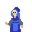 |  |
> | 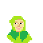 |  |
> | 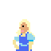 | _p0884_Die_einzige_Hexenverbrennung_zu_Wien.jpg) |
> | 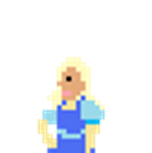 | This one is fictional because there is no image about her |
> | 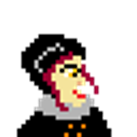 |  |
> | 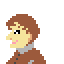 |  |
> | 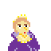 |  |
> | 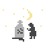 | no image |
> | 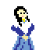 |  |
> | 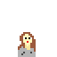 |  |
>
> You can get more about the in-game witches and the historical person collection in the [witches/README.md](witches/README.md).
>
> The same happened with the inquisitors as well. I tried to create real, history-based main characters. Here I have to say that, in reality, most of the inquisitors that I find were very young, compared to what is in the mainstream. Luckily all of them could fit in the 13 Kilobyte version of the game.
>
> | Inquisitor's in-game profile | Wikipedia article about the person |
> | ---------------------------- | ------------------------------- |
> | [Matthew Hopkins](MatthewHopkins.js) |  [Matthew Hopkins](https://en.wikipedia.org/wiki/Matthew_Hopkins) |
> | [Jacob Sprenger](JacobSprenger.js) |  [Jacob Sprenger](https://en.wikipedia.org/wiki/Jacob_Sprenger) |
> | [Charles Borromeo](CharlesBorromeo.js) | [Charles Borromeo](https://en.wikipedia.org/wiki/Charles_Borromeo) |
> | [Samuel Parris](SamuelParris.js) | [Samuel Parris](https://en.wikipedia.org/wiki/Samuel_Parris) |
> | [Heinrich Kramer](HeinrichKramer.js) | [Heinrich Kramer](https://en.wikipedia.org/wiki/Heinrich_Kramer) |
>
> Here I tried to choose the main characters from different parts of the world, that's why you can see persons from the famous Salem case to the main character of the Inquisition in Europe, or from England. The design ideas behind the characters are the same. I tried to set the traits in the same way as it was in history. The images presented in the game about these characters are very similar to the original person's illustrations.
>
> | Inquisitor's in-game representation | Historical representation |
> | ------------------------------ | ------------------------- |
> | 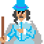 |   |
> | 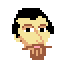 |   |
> | 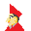 |  |
> |  |  |
> |  |  |
>
> More about the inquisitors in the [characters/README.md](characters/README.md)

## The gameplay
> The original idea of the gameplay was to create a detailed investigation into the witches where several people, NPCs will help the player. Due to the size limitations, I added only a helpful cat.
>
> 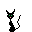
>
> This cat plays the main role as a hub in the game. From the hub, you can heal or attach the witches. To understand better here is a graph about the game flow.
> 
> 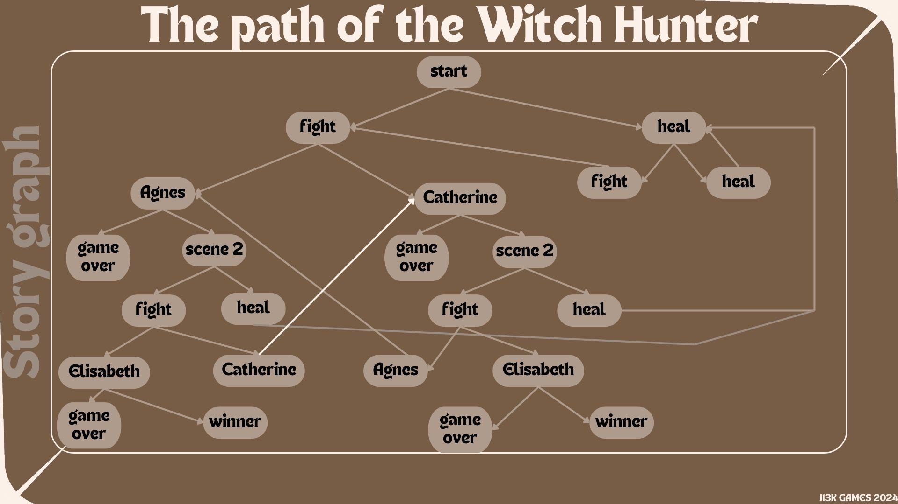
>
> Below you can find a gameplay video:
>
> 

## Tech stack
> To create the game I used [cursor](https://www.cursor.com) IDE. To refresh my full-stack knowledge I used JS and A-frame with HTML5. Tested on Desktop and Meta Quest 2.

----------------------------------------------------------------

 Creaated with ❤️ |  All rights reserved!
